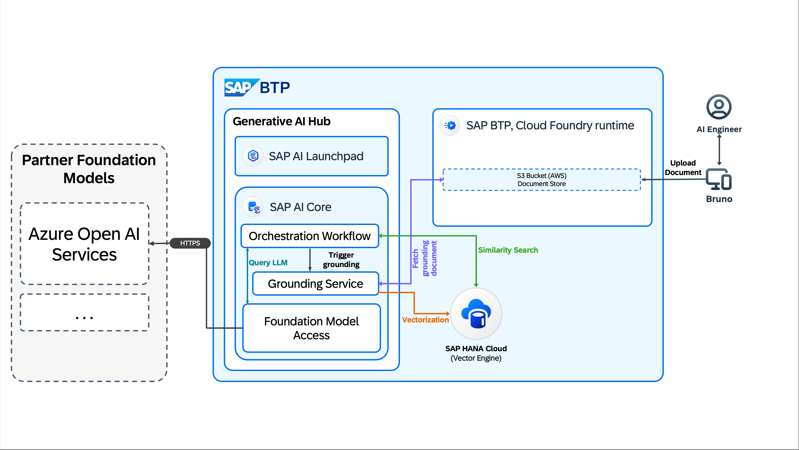

# AI Developer Challenge April 2026 - build AI Agents with Generative AI Hub

For this month's coding challenge on the SAP Community, you will have the opportunity to learn more about the Orchestration Workflow available on Generative AI Hub with SAP AI Core. You will also work on building your first code-based agents with CrewAI and LiteLLM.

**What you'll learn:** Build production-ready AI solutions that combine Retrieval-Augmented Generation (RAG) with intelligent agents. You will learn how to work with the APIs of the SAP Cloud SDK for AI to create an orchestration workflow including document grounding, and build code-based agents that leverage grounded document information to provide accurate, context-aware responses.

The coding challenge will span over the next four weeks where you will be working on 4 separate challenges, one for each week. At the end of each week you need to upload the results of the given week's challenge. This can be a screenshot or a configuration file, but no worries, each week's challenge will exactly tell you what to do.

But first, let's set the stage.

## Setting the stage

The United Nations has designated 2026 as the International Year of Volunteers and we want you to think about what such an initiative could be.

**Why this matters:** Volunteer organizations often struggle with information accessibility - experienced knowledge is scattered across documents, reports, and guides. By combining AI orchestration with document grounding, you can create intelligent assistants that make this knowledge instantly accessible to volunteers in the field, enabling them to make better decisions and have greater impact.

For this month's coding challenge, you'll build a system that could support volunteer initiatives by grounding and orchestrating contextual information to a Large Language Model (LLM). Here is the use case for this challenge:

**Social Services in Germany**

For this month's code challenge, you will build an intelligent solution for social wellfare service recipients to fetch information about the "Grundsicherung", a social service for unemployed citizens in Germany. On top of that the service should help social wellfare service recipients to find information about food banks in Germany, these food banks are provided through an organization called "Tafel Deutschland".

## The Solution Diagram

For this challenge you are using different systems to achieve an automated grounding process and you will set up an orchestration workflow on Generative AI Hub.

# The Challenge

[Week 1](exercises/week1_grounding.ipynb) — Build a RAG pipeline using SAP Generative AI Hub's Orchestration Service with document grounding and prompt templates.

[Week 2](exercises/week2_agent.ipynb) — Create your first AI agent with CrewAI connected to LLMs via SAP Generative AI Hub.

[Week 3](exercises/week3_agent_grounding_tool.ipynb) — Give your agent a grounding tool so it can autonomously retrieve relevant documents before responding.
                                                                                                                                    
[Week 4](exercises/week4_rpt1.md) — Use SAP's RPT-1 foundation model to predict missing data points via regression and classification — no model training required.
